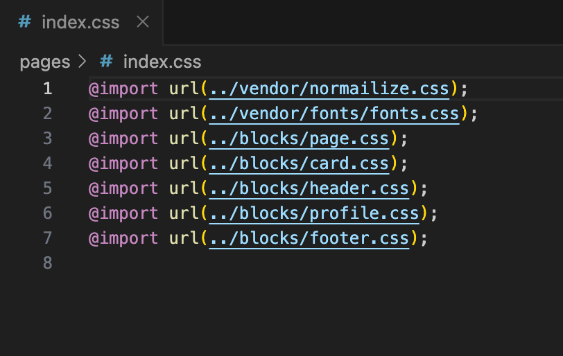
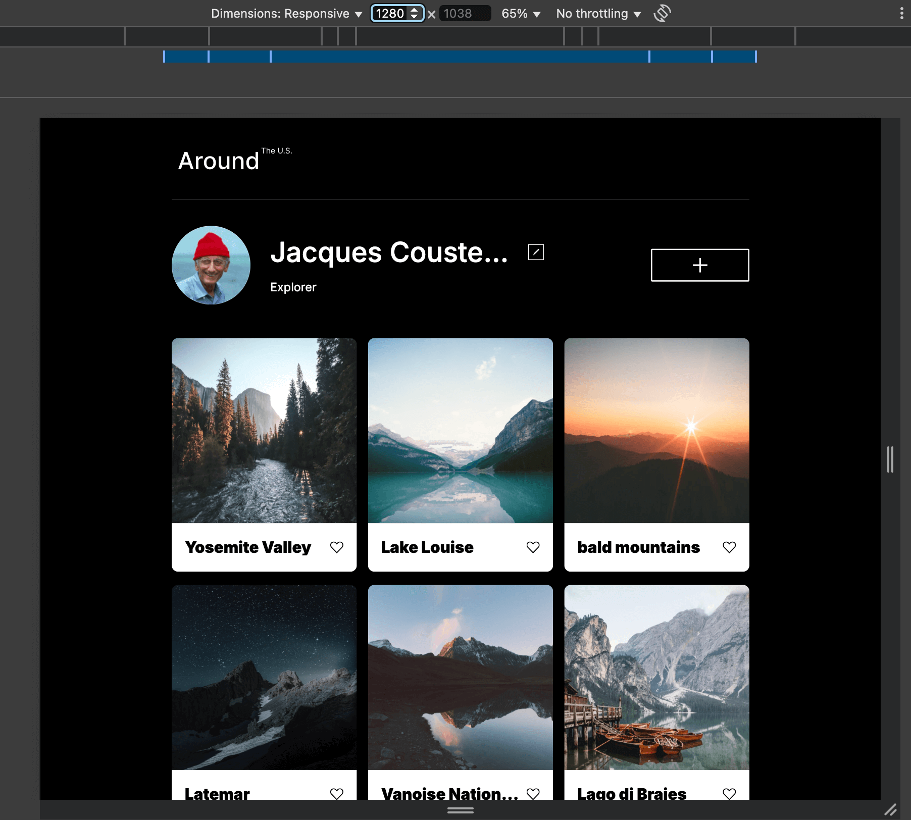
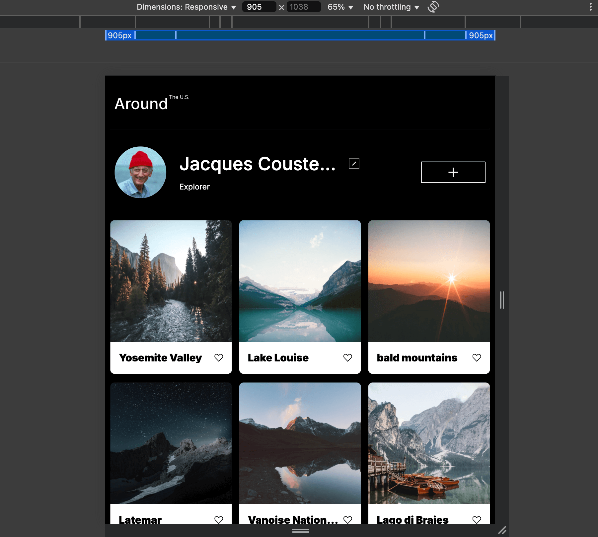
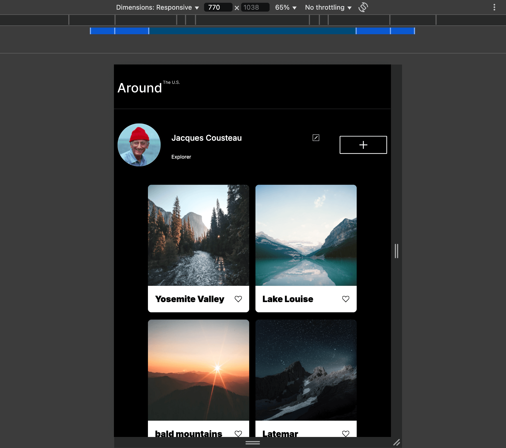
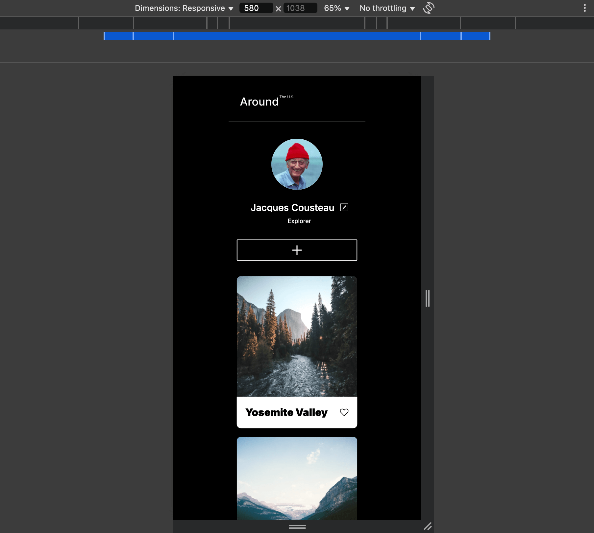

# Project 3: Around The U.S.

**Intro**

_This is the third project in the full stack development program in TripleTen school. It was created using responsive design that can be viewed in phones, tablets and computers. It is build using HTML and CSS, Based on the design from figma._

**Figma**

- [Link to the project on Figma](https://www.figma.com/file/ii4xxsJ0ghevUOcssTlHZv/Sprint-3%3A-Around-the-US?node-id=0%3A1)

**LINK**

- [Link to the project](https://ryan-hitech.github.io/se_project_aroundtheus/)

## Project Features

- semantic HTML5

* Flexbox
* Grid
* Responsive Design
* Positioning
* Flat BEM file structure

- Media queries
- CSS transition.

## Description

[project video](https://drive.google.com/file/d/1qCmRMrNHV3ydibLGE_mJHiJlQVwx1SKH/view?usp=sharing)

- For code i used the visual studio code or VS Code.

* The project was build using BEM Methodology which stands for block , element , modifier.

- The styling in css was done using the bem class naming method , and block were : card.css , footer.css, header.css, page.css, profile.css and they were all imported to index.css.
  and then they were links to our index.html file.

- AS it is shown on the screen shot , i put normilize.css and the top of the index.css and after it the fonts.css because in css browser reads it from the bottom up and it can be problematic to put normilize.css in the bottom .

* For this project i used a responsive design that can be viewed in different screens like phone , laptops, tablets thank to media queries.
  for this project i started in 1280 px and then adjusted the layout to the size of tablet using media querie 770px and then to the size of a phone using another media querie 580px.
  in order to prevent elements from touching the sides of the screen in small computer i used the fourth and last media querie which is 905px.

* Here are some images of the layouts in different sizes:

1. Computer 1280px
   

2. Computer 905px
   

3. Tablets 770px
   

4. Cellphones 580px
   

- For the layout i used Flexbox to position elements in a one directional axis .
  and i used Grid for two dimensions like in the profile.css and card.css .
